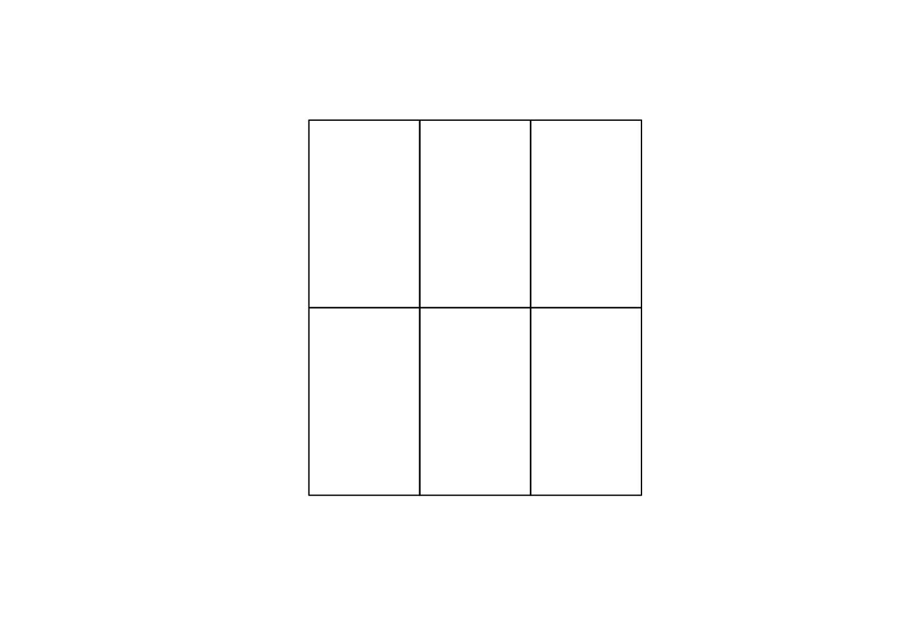

wikimapR, an R package for importing Wikimapia data as Simple Features
via API
================

<!-- README.md is generated from README.Rmd. Please edit that file -->

[](https://zenodo.org/badge/latestdoi/161494897)

`wikimapR` is an R package for accessing the raw vector data from
Wikimapia via official [Wikimapia API](http://wikimapia.org/api). Map
data is returned as [Simple Features
(`sf`)](https://cran.r-project.org/package=sf) objects with some of the
object details included as nested `lists`.

WARNING: the package may NOT work for now because of the breaking change in the Wikimapia API. More details at: https://github.com/e-kotov/wikimapR/issues/2 . Using 'example' API key does not work, however everything seems to be working with your a private API key.

**This package is at a VERY alpha stage. Provided ‘as is’. Use with
caution.**

You may also want to try [a similar package for
Python](https://github.com/plandex/wikimapia-api-py).

### Installation

To install:

``` r
# Install the development version
# install.packages("devtools")
devtools::install_github("e-kotov/wikimapR")
```

To load the package and check the version:

``` r
library(wikimapR)
packageVersion("wikimapR")
#> [1] '0.1.1'
```

### Usage

#### Choose a bbox

Have a look at <https://boundingbox.klokantech.com> and choose a
bounding box. For example: `49.990525,53.100579,50.37642,53.334931` for
Samara and it’s surroundings.

``` r
bbox <- c(49.990525,53.100579,50.37642,53.334931) # Samara
```

#### Get the number of objects in this bounding box

Use [`box`](http://wikimapia.org/api#oldbox) API function to get the
number of features on your area of interest.

``` r
wm <- wm_get_from_bbox(x = bbox, get_location = FALSE, meta_only = TRUE)
#> Warning in wm_get_from_bbox(x = bbox, get_location = FALSE, meta_only =
#> TRUE): Using 'example' API key. This key can only be used for testing. The
#> interval for using this key is 30 seconds. Get your own API key at http://
#> wikimapia.org/api?action=create_key .
# wm <- wm_get_from_bbox(x = bbox, get_location = F, wm_api_key = "XXXXXXX", object_count_only = T) # use with your own API key to perform more frequent requests and avoid the warning message
wm$found
#> [1] 21026
```

Now we know how many objects we have in the bounding box.

There are `page` and `count` parameters in the Wikimapia API, but you
cannot request objects from a bounding box beyond 10 000 no matter how
high you set the `page` parameter. So you have to subdivide the large
bounding box that you have into smaller bounding boxes with a maximum of
10 000 objects each.

#### Subdivide the bounding box into smaller ones

`subdivide_bbox()` subdivides a large bounding box into smaller ones and
returns `sf polygons`, or `bbox` objects or both. It is good for large
areas with defaults tuned to cities like Moscow.

``` r
small_bboxes <- subdivide_bbox(x = bbox, bbox_cell_size = 0.1, return_bbox_or_sf = "both")
#> Linking to GEOS 3.7.2, GDAL 2.4.2, PROJ 5.2.0
#> 12 bounding boxes created with approximate cell size of 6698x11129 meters.
plot(small_bboxes$sf$geometry)
```



``` r
str(small_bboxes, max.level = 1)
#> List of 2
#>  $ bbox:List of 12
#>  $ sf  :Classes 'sf' and 'data.frame':   12 obs. of  2 variables:
#>   ..- attr(*, "sf_column")= chr "geometry"
#>   ..- attr(*, "agr")= Factor w/ 3 levels "constant","aggregate",..: NA
#>   .. ..- attr(*, "names")= chr "fid"
```

In this example the bounding box cell size is in degrees (need to
somehow fix that to work with meters across the globe). Default of 0.045
degrees is reasonably large, roughly equivalent to 2845x5010 meters. It
has proved to fit \< 10 000 objects per cell in Moscow, where the
density of objects is quite high. For less object-dense cities you may
be able to get away with larger grid of bounding boxes.

This is not ideal and it would be more convenient to create this
subdivision using precise metric, but this will do fine for now.

#### Check then number of objects per cell

Just to be sure that every bounding box that we generated has \<= 10 000
objects, let us query all the bounding boxes. For the current example
with 12 it will take about 6 minutes, as with “example” API key the
cool-down is about 30 seconds.

``` r
pb <- dplyr::progress_estimated(length(small_bboxes$bbox)) # set the progress bar using dplyr

objects_in_bboxes <- small_bboxes$bbox %>% purrr::map( ~ {
  pb$tick()$print() # print progress
  Sys.sleep(30) # wait for API required interval, sleep goes before the function itself for the map to correctly collect values in the list
  wm_get_from_bbox(x = .x, get_location = FALSE) # get objects in every bbox, but no need to get the location for now
  }
)
```

Now we look at the histogram of the number of objects in the small
bounding boxes and the maximum value:

``` r
n_by_bbox <- objects_in_bboxes %>% purrr::map_int(~ .x$meta$found) # extract the number of found objects for every bounding box
max(n_by_bbox)
#> [1] 6971
hist(n_by_bbox)
```


Since the maximum is well within 10 000, we can proceed to collect the
objects IDs and then download attributes for individual features. We
have to download the detailed objects features one-by-one as
[`box`](http://wikimapia.org/api#oldbox) API only returns object ID,
name and URL. So the strategy for getting all object details is to make
a list of object IDs using [`box`](http://wikimapia.org/api#oldbox) API
and then use [`place.getbyid`](http://wikimapia.org/api#placegetbyid).

#### Create a list of IDs to fetch

``` r
id_list <- objects_in_bboxes %>%
  purrr::map(~ .x$df$id) %>% # pull object IDs from individual bbox query results data.frames
  do.call(c, .) # bind together

str(id_list)
#>  chr [1:1117] "3441705" "12114255" "33569609" "12626690" "3449460" ...
head(id_list)
#> [1] "3441705"  "12114255" "33569609" "12626690" "3449460"  "22644133"
```

Now we have a list of 1117 object IDs that we want to get the details
for.

#### Get detailed data for Wikimapia objects

Let's take just 3 first objects for this example. It will take 1.5 minutes to fetch them with all the details using the example API.

``` r
short_list <- id_list[1:3]
wm_objects <- wm_get_by_id(x = short_list)
```

#### We have the objects\!

``` r
str(wm_objects, max.level = 1, nchar.max = 50)
#> Classes 'sf', 'data.table' and 'data.frame': 3 obs. of  25 variables:
#>  $ id                    : int  3441705 12114255 33569609
#>  $ object_type           : int  1 1 1
#>  $ language_id           : int  1 1 1
#>  $ language_iso          : chr  "ru" "ru" "ru"
#>  $ language_name         : chr  "Russian" "Russian" "Russian"
#>  $ urlhtml               : chr  "<a class=\"wikimapia-link\" href="| __truncated__ "<a class=\"wikimapia-link\" href="| __truncated__ "<a class=\"wikimapia-link\" href="| __truncated__
#>  $ title                 : chr  "Остров Поджабный (Рождественский)" "Самарский район" "Протока Проран"
#>  $ description           : chr  "Остров в юго-восточной части Сама"| __truncated__ "Самарский район - один из централ"| __truncated__ "На протоке на острове Поджабном р"| __truncated__
#>  $ wikipedia             : chr  "https://ru.wikipedia.org/wiki/Поджабный_остров" "http://ru.wikipedia.org/wiki/Сама"| __truncated__ NA
#>  $ is_building           : logi  FALSE FALSE FALSE
#>  $ is_region             : logi  FALSE FALSE FALSE
#>  $ is_deleted            : logi  FALSE FALSE FALSE
#>  $ parent_id             : chr  "0" "0" "0"
#>  $ x                     : chr  "500164606" "500852939" "500122546"
#>  $ y                     : chr  "531864365" "531810489" "532005295"
#>  $ pl                    : num  45136 22233 21906
#>  $ is_protected          : logi  FALSE FALSE FALSE
#>  $ user_id               : Factor w/ 2 levels "2236373","1556590": 1 2 1
#>  $ user_name             : Factor w/ 2 levels "Onsk","Hamster32": 1 2 1
#>  $ date                  : Factor w/ 3 levels "1450154348","1422482102",..: 1 2 3
#>  $ deletion_state        : Factor w/ 1 level "FALSE": 1 1 1
#>  $ is_in_deletion_queue  : Factor w/ 1 level "FALSE": 1 1 1
#>  $ is_in_undeletion_queue: Factor w/ 1 level "FALSE": 1 1 1
#>  $ details               :List of 3
#>  $ geometry              :sfc_POLYGON of length 3; first list element: List of 1
#>   ..- attr(*, "class")= chr  "XY" "POLYGON" "sfg"
#>  - attr(*, "sf_column")= chr "geometry"
#>  - attr(*, "agr")= Factor w/ 3 levels "constant","aggregate",..: NA NA NA NA NA NA NA NA NA NA ...
#>   ..- attr(*, "names")= chr  "id" "object_type" "language_id" "language_iso" ...
```

##### We can now plot them

``` r
plot(wm_objects$geometry)
```


##### We can explore the attributes

``` r
names(wm_objects)
#>  [1] "id"                     "object_type"           
#>  [3] "language_id"            "language_iso"          
#>  [5] "language_name"          "urlhtml"               
#>  [7] "title"                  "description"           
#>  [9] "wikipedia"              "is_building"           
#> [11] "is_region"              "is_deleted"            
#> [13] "parent_id"              "x"                     
#> [15] "y"                      "pl"                    
#> [17] "is_protected"           "user_id"               
#> [19] "user_name"              "date"                  
#> [21] "deletion_state"         "is_in_deletion_queue"  
#> [23] "is_in_undeletion_queue" "details"               
#> [25] "geometry"
```

##### Most of the details are currently in a nested list for every object

You can use [purrr](https://github.com/tidyverse/purrr) and/or
[rlist](https://github.com/renkun-ken/rlist) packages to pull any of the
details from these nested lists.

``` r
str(wm_objects$details[[1]], max.level = 1)
#> List of 5
#>  $ tags              :List of 1
#>  $ photos            :List of 4
#>  $ comments          :List of 1
#>  $ location          :List of 15
#>  $ availableLanguages:List of 2
```

### To-Do List

  - Rewrite `subdivide_bbox()` to accept metric values for bbox
    dimensions (not critical, but may be useful for other projects)

  - Create a few more helper functions to abstract the user from the
    calls to `purrr` for simple things like getting the number of found
    objects, or for getting number of objects per bounding box (see
    examples above in the Usage section)

  - Create a hidden environment variable for storing API key and using
    it automatically in the package functions

  - Implement the rest of the Wikimapia API functions

  - Fix bugs if any

  - Make code more robust

  - Write unit tests

  - Your suggestions are welcome via GitHub issues for this package

  - Submit the package to CRAN someday..?

### Citation

``` r
citation ("wikimapR")
#> 
#> To cite package 'wikimapR' in publications use:
#> 
#>   Egor Kotov (2018). wikimapR: Import Wikimapia Data as Simple
#>   Features via API. R package version 0.1.1.
#>   https://github.com/e-kotov/wikimapR/
#> 
#> A BibTeX entry for LaTeX users is
#> 
#>   @Manual{,
#>     title = {wikimapR: Import Wikimapia Data as Simple Features via API},
#>     author = {Egor Kotov},
#>     year = {2018},
#>     note = {R package version 0.1.1},
#>     url = {https://github.com/e-kotov/wikimapR/},
#>   }
```

### License

The MIT License (MIT) + License File

Copyright © 2018 Egor Kotov

Permission is hereby granted, free of charge, to any person obtaining a
copy of this software and associated documentation files (the
“Software”), to deal in the Software without restriction, including
without limitation the rights to use, copy, modify, merge, publish,
distribute, sublicense, and/or sell copies of the Software, and to
permit persons to whom the Software is furnished to do so, subject to
the following conditions:

The above copyright notice and this permission notice shall be included
in all copies or substantial portions of the Software.

THE SOFTWARE IS PROVIDED “AS IS”, WITHOUT WARRANTY OF ANY KIND, EXPRESS
OR IMPLIED, INCLUDING BUT NOT LIMITED TO THE WARRANTIES OF
MERCHANTABILITY, FITNESS FOR A PARTICULAR PURPOSE AND NONINFRINGEMENT.
IN NO EVENT SHALL THE AUTHORS OR COPYRIGHT HOLDERS BE LIABLE FOR ANY
CLAIM, DAMAGES OR OTHER LIABILITY, WHETHER IN AN ACTION OF CONTRACT,
TORT OR OTHERWISE, ARISING FROM, OUT OF OR IN CONNECTION WITH THE
SOFTWARE OR THE USE OR OTHER DEALINGS IN THE SOFTWARE.
